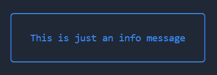

# bit-message-box

Just a simple plugin that adds border around your console messages in NodeJS terminal.

For more customization options, consider using [boxen](https://www.npmjs.com/package/boxen) and [chalk](https://www.npmjs.com/package/chalk) plugins.

## Installation

Install the plugin:

```
npm install --save-dev bit-message-box
```

Add it to your script:

```js
const msg = require("bit-message-box");
```

## Methods

| Name    | Result                                 |
| ------- | -------------------------------------- |
| `log`   | Returns white text with green border   |
| `info`  | Returns blue text with blue border     |
| `warn`  | Returns yellow text with yellow border |
| `error` | Returns red text with red border       |

## Example

```js
msg.info('This is just an info message')
```



## Author
Vladimir Jovanović | [LinkedIn](https://www.linkedin.com/in/vladimir79/) | [Twitter - @bitersen](https://twitter.com/bitersen)